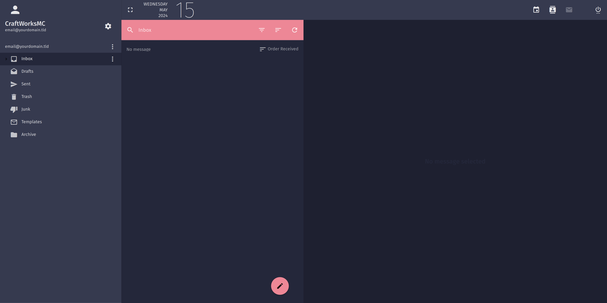

<h3 align="center">
    <br/>
    
    Catppuccin for <a href="https://github.com/mailcow/mailcow-dockerized">Mailcow SOGo</a>
    
</h3>

## 📷 Preview

🌺 Macchiato


## ⬇️ Usage


1. copy CSS file to mailcow server `data/conf/sogo/custom-theme.css`
2. edit `data/conf/sogo/sogo.conf` and set `SOGoUIxDebugEnabled = NO;`
3. append/create `docker-compose.override.yml` with:
```
version: '2.1'

services:
  sogo-mailcow:
    volumes:
      - ./data/conf/sogo/custom-theme.css:/usr/lib/GNUstep/SOGo/WebServerResources/css/theme-default.css:z
```

4. Run:
```
docker compose up -d
```

12. Run:
```
docker compose restart memcached-mailcow
```

<p align="center">
    
</p>

<p align="center">
    Copyright &copy; 2021-present <a href="https://github.com/catppuccin" target="_blank">Catppuccin Org</a>
</p>

<p align="center">
    <a href="https://github.com/catppuccin/catppuccin/blob/main/LICENSE"></a>
</p>
